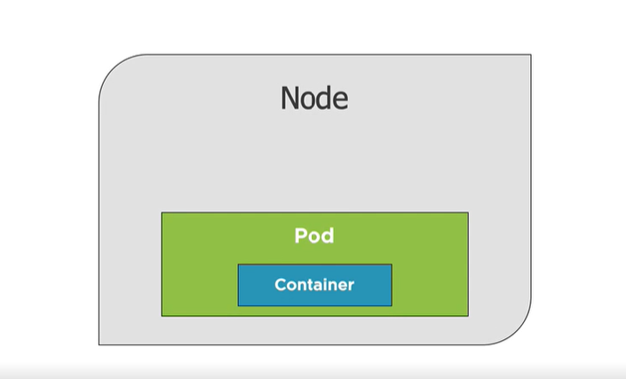
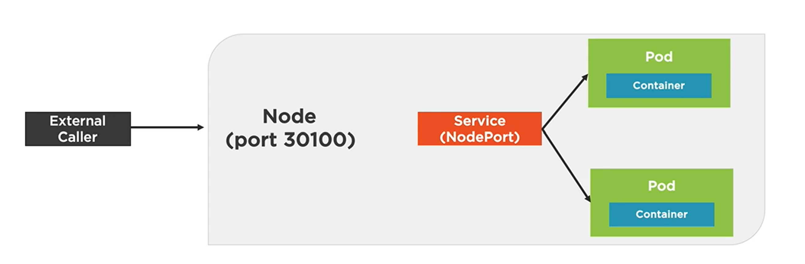

## Kubernetes

- https://app.pluralsight.com/library/courses/kubernetes-developers-core-concepts

### Kubernetes from a Developer Perspective

- Kubernetes is the conductor of the containers
- Service Discovery
- Load Balancing
- Storage Orchestration
    - Like Docker volumes
- Automate Rollouts/Rollbacks
- Self-healing of containers    
    - Automatically turn containers back on
- Secret and Configuration Management
- Horizontal Scaling

### The Big Picture

- You tell kubernetes here's where am I and here's where I want to go, Kubernetes does the rest


- A pod is a way to run a container
- It's the packaging that contains the container


- We talk to the container through the `pod`
- Pods don't exist on their own
- Need a way to deploy the pods
    - `Deployment and Replica Sets`
- Need a way for pods to communicate with the outside world or amongst themselves
    - `Services`
        - Containers are running
        - Containers are healthy
        - Etc


- A `Node` can run or more `pods`

<br>

- The master node's `Store` (etcd) is like a database for everything that the master node needs to track
- `Controller Manager` handles requests coming in and schedules those things using a `Scheduler`
- `API Server` can be used to interact with the master node using `kubectl`


<br>

- `Nodes` need a way to talk back and forth with the master, `Kubelet`
- Need a container runtime
- Need networking capabilities - `Kube-Proxy`


### Benefits and Use Cases

**Container Benefits**

- Accelerate Developer Onboarding
- Run multiple versions of the same app
- Environment Consistency between dev, qa, and prod
- Ship software faster

**Key Kubernetes Benefits**

- Orchestrate Containers in production
- Zero Downtime Deployments
- Self-heals containers
    - Replaces unhealthy containers
- Scale containers

**Developer Use Cases**

- Emulate production locally
- Create an end-to-end testing environment
- Ensures application scales properly
    - Easy to test this with kubernetes
- Ensure secrets/config are working properly
- Performance testing scenarios
- Workload scenarios
    - CI/CD for example
- Different deployment strategies
    - Canary testing
    - Blue/Green testing
    - A/B testing
    - Zero downtime deployments

### Running Kubernetes Locally

- Docker desktop is probably the easiest way to do it

### Getting Started with kubectl


### Kubernetes Web UI Dashboard


## Creating Pods

### Core Concepts

- A pod is the basic execution unit of a kubernetes application
    - The smallest and simplest unit in the Kubernetes object model that you create or deploy

- Pods run containers - they are the environment in which containers run
- Organize your application "parts" into Pods (server, caching, APIs, database, etc)
- Pod's IP address, memory, volumes, and etc are shared across containers within that pod
- Scale horizontally by adding Pod replicas
- Pods live and die but never come back to life
- It's possible for them to have more than 1 container

<br>

- A node has pod(s) that run a container(s)




- Pods can be horizontally scaled using replicas


- Kubernetes will load balance between these 3
- Pods within a node will have a unique ip address (a cluster ip)
- Containers will use a unique port within the port

<br>

- Pod containers have the same loopback network interface (localhost)
- Container processes need to bind to different ports within a Pod
- Ports, of course, can be reused by containers in separate pods

<br>

- Pods never span multiple nodes - they are always on a single node

### Creating a Pod


- Pods and containers are only accessible within the Kubernetes cluster by default
- One way to expose a container port externally (in the imperative model) is using `kubectl port-forward`
    - `kubectl port-forward [name-of-pod] 8080:80`
    - 8080 is external port
    - 80 is the internal port
- Deleting a pod `kubectl delete pod [name-of-pod]
    - Kubernetes will automatically recreate this pod
    - You would need to create the original `deployment` for the pod
    - `kubectl delete deployment [namm-of-deployment]`

### kubectl and Pods

```
PS C:\workspace\learning-kubernetes> kubectl run my-nginx --image=nginx:alpine
deployment.apps/my-nginx created
PS C:\workspace\learning-kubernetes> kubectl get all
NAME                            READY   STATUS    RESTARTS   AGE
pod/my-nginx-576bb7cb54-nrfll   1/1     Running   0          22s

NAME                 TYPE        CLUSTER-IP   EXTERNAL-IP   PORT(S)   AGE
service/kubernetes   ClusterIP   10.96.0.1    <none>        443/TCP   23h

NAME                       READY   UP-TO-DATE   AVAILABLE   AGE
deployment.apps/my-nginx   1/1     1            1           22s

NAME                                  DESIRED   CURRENT   READY   AGE
replicaset.apps/my-nginx-576bb7cb54   1         1         1       22s
```

- Note below that we deleted the pod but then using `kubectl get all` we still have a pod (with a different name)

```
PS C:\workspace\learning-kubernetes> kubectl delete pod my-nginx-576bb7cb54-nrfll
pod "my-nginx-576bb7cb54-nrfll" deleted
PS C:\workspace\learning-kubernetes> kubectl get all
NAME                            READY   STATUS    RESTARTS   AGE
pod/my-nginx-576bb7cb54-7x5kh   1/1     Running   0          17s

NAME                 TYPE        CLUSTER-IP   EXTERNAL-IP   PORT(S)   AGE
service/kubernetes   ClusterIP   10.96.0.1    <none>        443/TCP   23h

NAME                       READY   UP-TO-DATE   AVAILABLE   AGE
deployment.apps/my-nginx   1/1     1            1           96s

NAME                                  DESIRED   CURRENT   READY   AGE
replicaset.apps/my-nginx-576bb7cb54   1         1         1       96s
```

- A `deployment` is responsible for making sure that the current state is maintained

- Port forwarding

```
PS C:\workspace\learning-kubernetes> kubectl port-forward my-nginx-576bb7cb54-7x5kh 8080:80   
Forwarding from 127.0.0.1:8080 -> 80
Forwarding from [::1]:8080 -> 80
```

- Deleting a deployment

```
PS C:\workspace\learning-kubernetes> kubectl delete deployment my-nginx
deployment.apps "my-nginx" deleted
```

- Our my-nginx pod is now gone

```
PS C:\workspace\learning-kubernetes> kubectl get pods
No resources found in default namespace.
```

### Defining a Pod with YAML

- We can write yaml/json that we give to kubernetes


- Can validate yaml (this is turned on by default)

```
PS C:\workspace\learning-kubernetes> kubectl create -f .\nginx.pod.yml --dry-run --validate=true
pod/my-nginx created (dry run)
```

```
PS C:\workspace\learning-kubernetes> kubectl create -f .\nginx.pod.yml
pod/my-nginx created
PS C:\workspace\learning-kubernetes> kubectl get all
NAME           READY   STATUS    RESTARTS   AGE
pod/my-nginx   1/1     Running   0          10s

NAME                 TYPE        CLUSTER-IP   EXTERNAL-IP   PORT(S)   AGE
service/kubernetes   ClusterIP   10.96.0.1    <none>        443/TCP   23h
```

- Can also use `kubectl apply -f file.pod.yml`
    - More flexible
    - Create if one isn't created
    - Update existing resource

- If you use create do `kubectl create -f file.pod.yml --save-config`
    - `--save-config` stores current properties in resource's annotations so that we can come back and use `kubectl apply` later


- Deleting a pod using yaml file

```
PS C:\workspace\learning-kubernetes> kubectl delete -f .\nginx.pod.yml
pod "my-nginx" deleted
```


- The `labels` can be used to link resources together
    - A deployment or service could reference this label for example to tie them together

<br>

- `kubectl get pod my-nginx -o yaml`

```
PS C:\workspace\learning-kubernetes> kubectl get pod my-nginx -o yaml
apiVersion: v1
kind: Pod
metadata:
  annotations:
    kubectl.kubernetes.io/last-applied-configuration: |
      {"apiVersion":"v1","kind":"Pod","metadata":{"annotations":{},"labels":{"app":"nginx","rel":"stable"},"name":"my-nginx","namespace":"default"},"spec":{"containers":[{"image":"nginx:alpine","name":"my-nginx","ports":[{"containerPort":80}]}]}}
  creationTimestamp: "2020-10-02T11:19:03Z"
  labels:
    app: nginx
    rel: stable
  managedFields:
  - apiVersion: v1
    fieldsType: FieldsV1
    fieldsV1:
      f:metadata:
        f:annotations:
          .: {}
          f:kubectl.kubernetes.io/last-applied-configuration: {}
        f:labels:
          .: {}
          f:app: {}
          f:rel: {}
      f:spec:
        f:containers:
          k:{"name":"my-nginx"}:
            .: {}
            f:image: {}
            f:imagePullPolicy: {}
            f:name: {}
            f:ports:
              .: {}
              k:{"containerPort":80,"protocol":"TCP"}:
                .: {}
                f:containerPort: {}
                f:protocol: {}
            f:resources: {}
            f:terminationMessagePath: {}
            f:terminationMessagePolicy: {}
        f:dnsPolicy: {}
        f:enableServiceLinks: {}
        f:restartPolicy: {}
        f:schedulerName: {}
        f:securityContext: {}
        f:terminationGracePeriodSeconds: {}
    manager: kubectl.exe
    operation: Update
    time: "2020-10-02T11:19:03Z"
  - apiVersion: v1
    fieldsType: FieldsV1
    fieldsV1:
      f:status:
        f:conditions:
          k:{"type":"ContainersReady"}:
            .: {}
            f:lastProbeTime: {}
            f:lastTransitionTime: {}
            f:status: {}
            f:type: {}
          k:{"type":"Initialized"}:
            .: {}
            f:lastProbeTime: {}
            f:lastTransitionTime: {}
            f:status: {}
            f:type: {}
          k:{"type":"Ready"}:
            .: {}
            f:lastProbeTime: {}
            f:lastTransitionTime: {}
            f:status: {}
            f:type: {}
        f:containerStatuses: {}
        f:hostIP: {}
        f:phase: {}
        f:podIP: {}
        f:podIPs:
          .: {}
          k:{"ip":"10.1.0.7"}:
            .: {}
            f:ip: {}
        f:startTime: {}
    manager: kubelet
    operation: Update
    time: "2020-10-02T11:19:10Z"
  name: my-nginx
  namespace: default
  resourceVersion: "1122"
  selfLink: /api/v1/namespaces/default/pods/my-nginx
  uid: ea8cc77c-cd22-495b-a6fa-d1676832f40e
spec:
  containers:
  - image: nginx:alpine
    imagePullPolicy: IfNotPresent
    name: my-nginx
    ports:
    - containerPort: 80
      protocol: TCP
    resources: {}
    terminationMessagePath: /dev/termination-log
    terminationMessagePolicy: File
    volumeMounts:
    - mountPath: /var/run/secrets/kubernetes.io/serviceaccount
      name: default-token-l8jjm
      readOnly: true
  dnsPolicy: ClusterFirst
  enableServiceLinks: true
  nodeName: docker-desktop
  priority: 0
  restartPolicy: Always
  schedulerName: default-scheduler
  securityContext: {}
  serviceAccount: default
  serviceAccountName: default
  terminationGracePeriodSeconds: 30
  tolerations:
  - effect: NoExecute
    key: node.kubernetes.io/not-ready
    operator: Exists
    tolerationSeconds: 300
  - effect: NoExecute
    key: node.kubernetes.io/unreachable
    operator: Exists
    tolerationSeconds: 300
  volumes:
  - name: default-token-l8jjm
    secret:
      defaultMode: 420
      secretName: default-token-l8jjm
status:
  conditions:
  - lastProbeTime: null
    lastTransitionTime: "2020-10-02T11:19:08Z"
    status: "True"
    type: Initialized
  - lastProbeTime: null
    lastTransitionTime: "2020-10-02T11:19:10Z"
    status: "True"
    type: Ready
  - lastProbeTime: null
    lastTransitionTime: "2020-10-02T11:19:10Z"
    status: "True"
    type: ContainersReady
  - lastProbeTime: null
    lastTransitionTime: "2020-10-02T11:19:08Z"
    status: "True"
    type: PodScheduled
  containerStatuses:
  - containerID: docker://fc1efada149e48f61206a6c7b5c6c78639422bace65d1733531abae532a37787
    image: nginx:alpine
    imageID: docker-pullable://nginx@sha256:a97eb9ecc708c8aa715ccfb5e9338f5456e4b65575daf304f108301f3b497314
    lastState: {}
    name: my-nginx
    ready: true
    restartCount: 0
    started: true
    state:
      running:
        startedAt: "2020-10-02T11:19:09Z"
  hostIP: 192.168.65.3
  phase: Running
  podIP: 10.1.0.7
  podIPs:
  - ip: 10.1.0.7
  qosClass: BestEffort
  startTime: "2020-10-02T11:19:08Z"
  ```

  - Note the `annotations` section - this is created when using `--save-config` when using the `create` command or when using the standard `apply` command

  <br>

  - `kubectl describe pod my-nginx`

```
  PS C:\workspace\learning-kubernetes> kubectl describe pod my-nginx
Name:         my-nginx
Namespace:    default
Priority:     0
Node:         docker-desktop/192.168.65.3
Start Time:   Fri, 02 Oct 2020 07:19:08 -0400
Labels:       app=nginx
              rel=stable
Annotations:  Status:  Running
IP:           10.1.0.7
IPs:
  IP:  10.1.0.7
Containers:
  my-nginx:
    Container ID:   docker://fc1efada149e48f61206a6c7b5c6c78639422bace65d1733531abae532a37787
    Image:          nginx:alpine
    Image ID:       docker-pullable://nginx@sha256:a97eb9ecc708c8aa715ccfb5e9338f5456e4b65575daf304f108301f3b497314
    Port:           80/TCP
    Host Port:      0/TCP
    State:          Running
      Started:      Fri, 02 Oct 2020 07:19:09 -0400
    Ready:          True
    Restart Count:  0
    Environment:    <none>
    Mounts:
      /var/run/secrets/kubernetes.io/serviceaccount from default-token-l8jjm (ro)
Conditions:
  Type              Status
  Initialized       True
  Ready             True
  ContainersReady   True
  PodScheduled      True
Volumes:
  default-token-l8jjm:
    Type:        Secret (a volume populated by a Secret)
    SecretName:  default-token-l8jjm
    Optional:    false
QoS Class:       BestEffort
Node-Selectors:  <none>
Tolerations:     node.kubernetes.io/not-ready:NoExecute for 300s
                 node.kubernetes.io/unreachable:NoExecute for 300s
Events:
  Type    Reason     Age        From                     Message
  ----    ------     ----       ----                     -------
  Normal  Scheduled  <unknown>  default-scheduler        Successfully assigned default/my-nginx to docker-desktop
  Normal  Pulled     2m22s      kubelet, docker-desktop  Container image "nginx:alpine" already present on machine
  Normal  Created    2m22s      kubelet, docker-desktop  Created container my-nginx       
  Normal  Started    2m22s      kubelet, docker-desktop  Started container my-nginx       
```


- `describe` is really good for viewing the different events that happen (which you can see above)

<br>

- Getting access to pod - `kubectl exec my-nginx -it sh`

<br>

- Editing yaml file for running pod - `kubectl edit -f nginx.pod.yml`
    - This will open some type of editor where you can edit the yaml


### Pod Health

- Kubernetes relies on Probes to determine the health of a container
- A `Probe` is a diagnostic performed periodically by the kubelet on a container
- Two types of probes
    - Liveness probe
    - Readiness Probe
- Liveness probe
    - Can be used to determine if a container is healthy and running as expected
- Readiness probe
    - Used to determine if a container should receive requests
- Failed Pod containers are recreated by default (restartPolicy defaults to Always)

#### Probe Types


##### Defining an HTTP Liveness Probe


##### Defining an ExecAction Liveness Probe


##### Defining a Readiness Probe


### Testing Readiness Probe

```
PS C:\workspace\learning-kubernetes> kubectl exec my-nginx -it sh
kubectl exec [POD] [COMMAND] is DEPRECATED and will be removed in a future version. Use kubectl kubectl exec [POD] -- [COMMAND] instead.
/ # cd usr/share/nginx/
/usr/share/nginx # ls
html
/usr/share/nginx # cd html/
/usr/share/nginx/html # ls
50x.html    index.html
/usr/share/nginx/html # rm index.html
/usr/share/nginx/html # command terminated with exit code 137
```

- Note here the `command terminated with exit code 137`
- This is where the readiness probe says the container isn't healthy anymore, a new contianer needs to be created

```
Events:
  Type     Reason     Age                 From                     Message
  ----     ------     ----                ----                     -------
  Normal   Scheduled  <unknown>           default-scheduler        Successfully assigned default/my-nginx to docker-desktop
  Warning  Unhealthy  73s                 kubelet, docker-desktop  Readiness probe failed: HTTP probe failed with statuscode: 404
  Warning  Unhealthy  71s                 kubelet, docker-desktop  Liveness probe failed: 
HTTP probe failed with statuscode: 404
  Normal   Killing    71s                 kubelet, docker-desktop  Container my-nginx failed liveness probe, will be restarted
  Normal   Pulled     70s (x2 over 117s)  kubelet, docker-desktop  Container image "nginx:alpine" already present on machine
  Normal   Created    70s (x2 over 117s)  kubelet, docker-desktop  Created container my-nginx
  Normal   Started    70s (x2 over 117s)  kubelet, docker-desktop  Started container my-nginx
  ```

  ## Creating Deployments

  ### Deployments Core Concepts

  - A `ReplicaSet` is a declarative way to manage Pods
  - A `Deployment` is a declarative way to manage Pods using a ReplicaSet
    - ReplicaSets came out before Deployments
    - Deployments then came out and wrap ReplicaSets and simplify functionality

<br>

- Deployments and ReplicaSets ensure Pods stay running and can be used to scale pods

<br>

**ReplicaSets**

- ReplicaSets act as a Pod Controller
  - Self-healing mechanism
  - Ensure the request number of Pods is available
  - Provides fault-tolerance
  - Can be used to scale pods horizontally (increasing 2 to 4)
  - Relies on a `Pod template`
  - `No need to create Pods directly`


<br>

**Deployments**

- A Deployment manages Pods
  - Pods are maanged using ReplicaSets
  - Scales ReplicaSets, which scales Pods
  - Supports zero-downtime updates by creating and destroying ReplicaSets
  - Provides rollback functionality
  - Creates a unique label that is assigned to the ReplicaSet and generated Pods

### Creating a Deployment


- Can have different probes in the yaml as well

### kubectl and Deployments

- `kubectl create -f file.deployment.yml`
  - Can't apply any changes unless you use `--save-config`
- `kubectl apply -f file.deployment.yml`
  - Allow you to apply changes later
- `kubectl get deployments`
- `kubectl get deployment --show-labels`
- Get all deployments with a specific label - `kubectl get deployment -l app=nginx`
- `kubectl delete deployment [deployment-name]`
- `kubectl scale deployment [deployment-name] --replicas=5`
  - can also pass the yaml file instead of deployment name

### kubectl Deployments in Action

- Deployment is tied to this name

```
metadata:
  name: my-nginx
  labels:
    app: my-nginx
```

- Resource constraints

```
resources:
  limits:
    memory: "128Mi" #128 MB
    cpu: "200m" #200 millicpu (.2 cpu or 20% of the cpu)
```

- Getting info about deployment

```
PS C:\workspace\learning-kubernetes> kubectl get all
NAME                            READY   STATUS    RESTARTS   AGE
pod/my-nginx                    1/1     Running   7          10d
pod/my-nginx-5fb9556b5c-665rn   1/1     Running   0          39s
pod/my-nginx-5fb9556b5c-s8n8x   1/1     Running   0          39s

NAME                 TYPE        CLUSTER-IP   EXTERNAL-IP   PORT(S)   AGE
service/kubernetes   ClusterIP   10.96.0.1    <none>        443/TCP   10d

NAME                       READY   UP-TO-DATE   AVAILABLE   AGE
deployment.apps/my-nginx   2/2     2            2           39s

NAME                                  DESIRED   CURRENT   READY   AGE
replicaset.apps/my-nginx-5fb9556b5c   2         2         2       39s
```

- Getting info about the deployment

```
PS C:\workspace\learning-kubernetes> kubectl describe deployment my-nginx
Name:                   my-nginx
Namespace:              default
CreationTimestamp:      Mon, 12 Oct 2020 22:34:13 -0400
Labels:                 app=my-nginx
Annotations:            deployment.kubernetes.io/revision: 1
Selector:               app=my-nginx
Replicas:               2 desired | 2 updated | 2 total | 2 available | 0 unavailable       
StrategyType:           RollingUpdate
MinReadySeconds:        0
RollingUpdateStrategy:  25% max unavailable, 25% max surge
Pod Template:
  Labels:  app=my-nginx
  Containers:
   my-nginx:
    Image:      nginx:alpine
    Port:       80/TCP
    Host Port:  0/TCP
    Limits:
      cpu:        200m
      memory:     128Mi
    Environment:  <none>
    Mounts:       <none>
  Volumes:        <none>
Conditions:
  Type           Status  Reason
  ----           ------  ------
  Available      True    MinimumReplicasAvailable
  Progressing    True    NewReplicaSetAvailable
OldReplicaSets:  <none>
NewReplicaSet:   my-nginx-5fb9556b5c (2/2 replicas created)
Events:
  Type    Reason             Age   From                   Message
  ----    ------             ----  ----                   -------
  Normal  ScalingReplicaSet  8h    deployment-controller  Scaled up replica set my-nginx-5fb9556b5c to 2
```

- Showing labels

```
PS C:\workspace\learning-kubernetes> kubectl get deployments --show-labels
NAME       READY   UP-TO-DATE   AVAILABLE   AGE     LABELS
my-nginx   2/2     2            2           2m41s   app=my-nginx
```

- Getting my app using the label

```
PS C:\workspace\learning-kubernetes> kubectl get deployments -l app=my-nginx
NAME       READY   UP-TO-DATE   AVAILABLE   AGE
my-nginx   2/2     2            2           3m3s
```

- You can manually scale a deployment using `kubectl scale -f [deployment file] --replicas=4`
- Can also do it in the actual yaml and use the `apply` command

```
apiVersion: apps/v1
kind: Deployment
metadata:
  name: my-nginx
  labels:
    app: my-nginx
spec:
  replicas: 6
  selector:
    matchLabels:
      app: my-nginx
...
```

### Deployment Options

- Deployments allow for zero downtime deployments (no impact to impacting end users)
- Several options available to do this
  - Rolling update
  - Blue-green deployments (AB deployments)
    - Have newer env and older env running at same time (limits risk)
    - Once the new one is good, we switch all traffic to the newer one
  - Canary deployments
    - Very small amount of traffic goes to new deployment
    - Once it's good, we direct all traffic to it
  - Rollbacks
    - Problem with new version, go back to previous version

**Rolling Update**

- Pod with new version is turned on
- Once it's turned on and running based on different probes - we delete one of the pods with app v1


- We follow this pattern until app v2 replaces all of app v1 - turn on app v2, delete one app running v1

### Zero Downtime deployment

- Kubernetes handles leaving current version of application running until new pod is ready for traffic
- You can follow this example in the `Zero Downtime Deployments in Action` lecture

## Creating Services

### Service Core Concepts

- A `Service` provides a single point of entry for accessing one or more pods
  - IP addresses can't be relied on because Pods go up and down resulting in IP address change
    - A Pod gets an IP address after it's been scheduled, you wouldn't know it ahead of time
- **Services abstract Pod IP address from consumers**
- IP address of service CAN be relied upon
- Service knows how to load balance between pods
- Relies on labels to associate a Service with a Pod
- Node's kube-proxy creates a virtual IP for services
- Uses Layer 4 (TCP/UDP over IP)
- **Services are not ephemeral**
  - This is the thing that a client will know about and needs to rely upon
- Creates endpoints which sit between a Service and a Pod


- Side note, a browser uses the same connection over and over for requests
  - So the service will use the same pod for the requests coming from the same browser

### Service Types

- Four main types
- **ClusterIP** - Expose the serviceon a cluster-internal IP (default)
- **NodePort** - Expose the service on each Node's IP at a static port
- **LoadBalancer** - Provision an external IP to act as a laod balancer for the service
- **ExternalName** - Maps a service to a DNS name

#### ClusterIP

- Sevice IP is exposed internally within the cluster
- Only Pods within the cluster can talk to the Service
- Allows Pods to talk to other Pods


#### NodePort Service

- Expose the Service on each Node's IP at a static port
- Allocates a port from a range (defaultis 30000 - 32767)
- Each node proxies the allocated port
- Very useful
  - External caller can call in
  - As a developer, we might want to have an external call for debugging/performance reasons - this service is very valuable for that



#### LoadBalancer Service

- Route to different nodes automatically
- Exposes a service externally
- Useful when combined with a cloud provider's load balancer
- Each Node proxies the allocated port


#### ExternalName Service

- Service that acts as an alias for an external service
- Define a service once that can proxy requests to the external service
- This keeps external service details hidden from the cluster - you just have to change the ExternalName service
- Proxy to external service


### Creating a Service with kubectl

#### Port Forwarding

- How can you access a Pod from outside of Kubernetes?
  - By default, you can't
  - You do this with port forwarding

- Listen on port 8080 locally and forward to port 80 in Pod
  - `kubectl port-forward pod/[pod-name] 8080:80`
- Listen on port 8080 locally and foward to Deployment's Pod
  - `kubectk port-forward deployment/[deployment-name] 8080`
- Listen on port 8080 locally and forward to Service's Pod
  - `kubectl port-forward service/[service-name] 8080`

##### Example Targeting Specific Pod

```
PS C:\workspace\learning-kubernetes> kubectl get pods
NAME                        READY   STATUS    RESTARTS   AGE
my-nginx-5fb9556b5c-2ldqx   1/1     Running   0          28s
my-nginx-5fb9556b5c-77r22   1/1     Running   0          28s
PS C:\workspace\learning-kubernetes> kubectl port-forward pod/my-nginx-5fb9556b5c-2ldqx 8080:80
Forwarding from 127.0.0.1:8080 -> 80
Forwarding from [::1]:8080 -> 80
```

- Target specific pod
- Can now hit port 8080 on host machine and it proxies to port 80 in pod running nginx

##### Example Targeting Deployment

```
PS C:\workspace\learning-kubernetes> kubectl get deployments
NAME       READY   UP-TO-DATE   AVAILABLE   AGE
my-nginx   2/2     2            2           2m15s
PS C:\workspace\learning-kubernetes> kubectl port-forward pod/my-nginx 8080:80
Error from server (NotFound): pods "my-nginx" not found
PS C:\workspace\learning-kubernetes> kubectl port-forward deployment/my-nginx 8080:80
Forwarding from 127.0.0.1:8080 -> 80
Forwarding from [::1]:8080 -> 80
```

- Can hit all the pods in a deployment

### Creating a Service with YAML

- Checkout out `./services` for example


- You can connect to a Service by it's DNS name
  - Done using the name in the metadata section


- Creating a NodePort Service


- Creating a LoadBalancer Service


- Creating an ExternalName Service

- Pods calling into this service would use external-servie:9090
- FQDN = Fully Qualified Domain Name


### kubectl and Services

- Use the `kubectl apply -f` to create
- Use `kubectl delete -f` to delete

<br>

- How can you quickly test if a Service and Pod is working
- Use `kubectl exec` to shell into a Pod/Container
  - `curl -s http://podIP`

<br>

- Services and pods are joined together using the selector

### kubectl Services in Action

#### Cluster IP Service

- Entering a pod

```
PS C:\workspace\learning-kubernetes> kubectl get pods
NAME                        READY   STATUS    RESTARTS   AGE
my-nginx-5fb9556b5c-2ldqx   1/1     Running   0          20m
my-nginx-5fb9556b5c-77r22   1/1     Running   0          20m
nginx-standalone            1/1     Running   0          12s
PS C:\workspace\learning-kubernetes> kubectl exec nginx-standalone -it sh
kubectl exec [POD] [COMMAND] is DEPRECATED and will be removed in a future version. Use kubectl kubectl exec [POD] -- [COMMAND] instead.
/ # curl http://10.1.5.155
<!DOCTYPE html>
<html>
<head>
<title>Welcome to nginx!</title>
<style>
    body {
        width: 35em;
        margin: 0 auto;
        font-family: Tahoma, Verdana, Arial, sans-serif;
    }
</style>
</head>
<body>
<h1>Welcome to nginx!</h1>
<p>If you see this page, the nginx web server is successfully installed and
working. Further configuration is required.</p>

<p>For online documentation and support please refer to
<a href="http://nginx.org/">nginx.org</a>.<br/>
Commercial support is available at
<a href="http://nginx.com/">nginx.com</a>.</p>

<p><em>Thank you for using nginx.</em></p>
</body>
</html>
```

- Getting IP of above example from other pod

```
c:\workspace>kubectl get pod my-nginx-5fb9556b5c-2ldqx -o json
{
    "apiVersion": "v1",
    "kind": "Pod",
    "metadata": {
        "creationTimestamp": "2021-03-29T23:24:24Z",
        "generateName": "my-nginx-5fb9556b5c-",
        "labels": {
            "app": "my-nginx",
            "pod-template-hash": "5fb9556b5c"
        },
        "managedFields": [
          ....
        ]
        "hostIP": "192.168.65.3",
        "phase": "Running",
        "podIP": "10.1.5.155",
        "podIPs": [
            {
                "ip": "10.1.5.155"
            }
        ],
        "qosClass": "Guaranteed",
        "startTime": "2021-03-29T23:24:24Z"
    }
}
```

- Well what happens if this pod goes away and another one comes up? How would you know the IP? This is where the `ClusterIP` service would come into play

```
PS C:\workspace\learning-kubernetes> kubectl apply -f .\samples\services\clusterIP.service.yml
service/nginx-clusterip created
PS C:\workspace\learning-kubernetes> kubectl get services
NAME              TYPE        CLUSTER-IP       EXTERNAL-IP   PORT(S)    AGE
kubernetes        ClusterIP   10.96.0.1        <none>        443/TCP    27m
nginx-clusterip   ClusterIP   10.102.115.247   <none>        8080/TCP   6s
```

- This IP - `10.102.115.247` - applies to the two pods with the label `my-nginx`
  - This matches the label for the clusterIP.service.yaml

- You can now talk from my-nginx-standalone to the pods with the my-nginx label

```
PS C:\workspace\learning-kubernetes> kubectl exec nginx-standalone -it sh
kubectl exec [POD] [COMMAND] is DEPRECATED and will be removed in a future version. Use kubectl kubectl exec [POD] -- [COMMAND] instead.
/ # curl http://10.102.115.247
^C
/ # curl http://10.102.115.247:8080
<!DOCTYPE html>
<html>
<head>
<title>Welcome to nginx!</title>
<style>
    body {
        width: 35em;
        margin: 0 auto;
        font-family: Tahoma, Verdana, Arial, sans-serif;
    }
</style>
</head>
<body>
<h1>Welcome to nginx!</h1>
<p>If you see this page, the nginx web server is successfully installed and
working. Further configuration is required.</p>

<p>For online documentation and support please refer to
<a href="http://nginx.org/">nginx.org</a>.<br/>
Commercial support is available at
<a href="http://nginx.com/">nginx.com</a>.</p>

<p><em>Thank you for using nginx.</em></p>
</body>
</html>
```

- You can also use the name under the metadata tag of the service - in our case `mynginx-clusterip`

```
/ # curl http://nginx-clusterip:8080
<!DOCTYPE html>
<html>
<head>
<title>Welcome to nginx!</title>
<style>
    body {
        width: 35em;
        margin: 0 auto;
        font-family: Tahoma, Verdana, Arial, sans-serif;
    }
</style>
</head>
<body>
<h1>Welcome to nginx!</h1>
<p>If you see this page, the nginx web server is successfully installed and
working. Further configuration is required.</p>

<p>For online documentation and support please refer to
<a href="http://nginx.org/">nginx.org</a>.<br/>
Commercial support is available at
<a href="http://nginx.com/">nginx.com</a>.</p>

<p><em>Thank you for using nginx.</em></p>
</body>
</html>
```

#### NodePort Service

```
PS C:\workspace\learning-kubernetes> kubectl apply -f .\samples\services\nodeport.service.yml
service/nginx-nodeport created
PS C:\workspace\learning-kubernetes> kubectl get services
NAME             TYPE        CLUSTER-IP      EXTERNAL-IP   PORT(S)        AGE
kubernetes       ClusterIP   10.96.0.1       <none>        443/TCP        33m
nginx-nodeport   NodePort    10.107.118.52   <none>        80:31000/TCP   5s
```

- Hit localhost (80 by default) from browser returns 404
- Hit localhost:31000 hits one of the my-nginx pods

#### LoadBalancer Service

```
PS C:\workspace\learning-kubernetes> kubectl apply -f .\samples\services\loadbalancer.service.yml
service/nginx-loadbalancer created
PS C:\workspace\learning-kubernetes> kubectl get services
NAME                 TYPE           CLUSTER-IP     EXTERNAL-IP   PORT(S)                      AGE
kubernetes           ClusterIP      10.96.0.1      <none>        443/TCP                      35m
nginx-loadbalancer   LoadBalancer   10.101.38.96   localhost     80:30764/TCP,443:30394/TCP   16s
```

- Can hit localhost from browser
- Note the `localhost` in the `EXTERNAL-IP` section
- Also note that the load balancer service also lets me talk to the pods behind the service using the name of the service or the IP of the service
- Note that the nodeport service allows you to talk to pods behind that service using the name of the service (in our case `nginx-nodeport`)

```
/ # curl http://nginx-nodeport
<!DOCTYPE html>
<html>
<head>
<title>Welcome to nginx!</title>
<style>
    body {
        width: 35em;
        margin: 0 auto;
        font-family: Tahoma, Verdana, Arial, sans-serif;
    }
</style>
</head>
<body>
<h1>Welcome to nginx!</h1>
<p>If you see this page, the nginx web server is successfully installed and
working. Further configuration is required.</p>

<p>For online documentation and support please refer to
<a href="http://nginx.org/">nginx.org</a>.<br/>
Commercial support is available at
<a href="http://nginx.com/">nginx.com</a>.</p>

<p><em>Thank you for using nginx.</em></p>
</body>
</html>
```


```
PS C:\workspace\learning-kubernetes> kubectl exec nginx-standalone -it sh
kubectl exec [POD] [COMMAND] is DEPRECATED and will be removed in a future version. Use kubectl kubectl exec [POD] -- [COMMAND] instead.
/ # curl http://10.1.5.155
<!DOCTYPE html>
<html>
<head>
<title>Welcome to nginx!</title>
<style>
    body {
        width: 35em;
        margin: 0 auto;
        font-family: Tahoma, Verdana, Arial, sans-serif;
    }
</style>
</head>
<body>
<h1>Welcome to nginx!</h1>
<p>If you see this page, the nginx web server is successfully installed and
working. Further configuration is required.</p>

<p>For online documentation and support please refer to
<a href="http://nginx.org/">nginx.org</a>.<br/>
Commercial support is available at
<a href="http://nginx.com/">nginx.com</a>.</p>

<p><em>Thank you for using nginx.</em></p>
</body>
</html>
/ # curl http://nginx-loadbalancer
<!DOCTYPE html>
<html>
<head>
<title>Welcome to nginx!</title>
<style>
    body {
        width: 35em;
        margin: 0 auto;
        font-family: Tahoma, Verdana, Arial, sans-serif;
    }
</style>
</head>
<body>
<h1>Welcome to nginx!</h1>
<p>If you see this page, the nginx web server is successfully installed and
working. Further configuration is required.</p>

<p>For online documentation and support please refer to
<a href="http://nginx.org/">nginx.org</a>.<br/>
Commercial support is available at
<a href="http://nginx.com/">nginx.com</a>.</p>

<p><em>Thank you for using nginx.</em></p>
</body>
</html>
```

## Understanding Storage Options

### Storage Core Concepts

- How do you store application/stat/data and exchange it between Pods with Kubernetes?
  - You can use `volumes`
    - There are other options too of course (like a database)
- A `Volume` can be used to hold data and state for Pods and containers
- Pods live and die so their file system is short-lived (ephemeral)
- A Pod can have multiple Volumes attached to it
- Containers rely on a `mountPath` to access a Volume
- Kubernetes supports
  - Volumes
  - PersistenVolumes
  - PersistentVolumeCLaims
- StorageClasses

### Volumes

- A Volume references a storage name
- Must have a unique name
- Attached to a Pod and may or may not be tied to a Pod's lifetime (depending on the Volume type)
- A Volume Mount references a Volume by name and defines a mountPath

##### Volume Type Examples

- emptyDir
  - Empty directory for storing "transient" data (shares a Pod's lifetime) useful for sharing files between containers running in a Pod
- hostPath
  - Pod munts into the node's filesystem
- nfs
  - An NFS (Network File System) share mounted into the pod
- configMap/secre
  - Special types of volumes that provide a Pod with access to Kubernetes resoures
- persistentVolumeClaim
  - Provides Pods with a more persistent data option that is abstracted from the details
- Cloud
  - Cluster-wide storage
- All options


#### Defining an emptyDir Volume

- Volume is lost when Pod goes down


#### Defining a hostPath Volume


#### Cloud Volumes

- Azure
  - Azure Disk and Azure File
- AWS
  - Elastic Block Store
- GCP
  - GCE Persistent Disk

#### Defining an Azure File Volume


#### Defining an AWS Volume


#### Defining GCP gcePersistenDisk Volume

- Similar to other 2 above

#### Viewing a Pod's Volumes

- Several techniques
- `kubectl describe pod [pod-name]`


- Can also do `kubectl get pod [pod-name] -o yaml` to get volumes

### Volumes in Action

- Examples can be found in `./samples/volumes`

#### emptyDir example

- Checking the `nginx` container

```
PS C:\workspace\learning-kubernetes> kubectl exec -i -t --container nginx nginx-alpine-volume -- sh
/ # cd usr/share/nginx/html/
/usr/share/nginx/html # ls
index.html
/usr/share/nginx/html # cat index.html
Fri Apr  2 11:48:18 UTC 2021
Fri Apr  2 11:48:28 UTC 2021
Fri Apr  2 11:48:38 UTC 2021
Fri Apr  2 11:48:48 UTC 2021
Fri Apr  2 11:48:58 UTC 2021
...
```

- Checking the `html-updater` container
- Note here that when a pod is running more than one container, you have to pass `--container <container-name>` as an argument to the `kubectl exec` command

```
PS C:\workspace\learning-kubernetes> kubectl exec -i -t --container html-updater nginx-alpine-volume -- sh
/ # ls
bin    etc    html   media  opt    root   sbin   sys    usr
dev    home   lib    mnt    proc   run    srv    tmp    var
/ # cd html/
/html # cat index.html
Fri Apr  2 11:48:18 UTC 2021
Fri Apr  2 11:48:28 UTC 2021
Fri Apr  2 11:48:38 UTC 2021
Fri Apr  2 11:48:48 UTC 2021
Fri Apr  2 11:48:58 UTC 2021
Fri Apr  2 11:49:08 UTC 2021
...
```

#### hostPath example

- Would like to mount to a directory that is on the host, the worker node where the Pod is running
- In this example, `var/run/docker.sock` in the container will talk to `/var/run/docker.sock` in the host


```
PS C:\workspace\learning-kubernetes> kubectl exec -it docker-volume -- sh
/ # docker

Usage:  docker [OPTIONS] COMMAND

A self-sufficient runtime for containers

Options:
      --config string      Location of client config files (default "/root/.docker")
  -c, --context string     Name of the context to use to connect to the daemon (overrides DOCKER_HOST env var and
                           default context set with "docker context use")
  -D, --debug              Enable debug mode
  -H, --host list          Daemon socket(s) to connect to
  -l, --log-level string   Set the logging level ("debug"|"info"|"warn"|"error"|"fatal") (default "info")
      --tls                Use TLS; implied by --tlsverify
      --tlscacert string   Trust certs signed only by this CA (default "/root/.docker/ca.pem")
      --tlscert string     Path to TLS certificate file (default "/root/.docker/cert.pem")
      --tlskey string      Path to TLS key file (default "/root/.docker/key.pem")
      --tlsverify          Use TLS and verify the remote
  -v, --version            Print version information and quit
...
```

- Our docker commands get forwarded to our host (worker node)
- All valid `types`:
  - DirectoryOrCreate
  - Directory
  - FileOrCreate
  - File
  - Socket
    - This is the one we used in this example
  - CharDevice
  - BlockDevice

### PersistentVolumes and PersistentVolumeClaims

- A `PersistentVolume` is a cluster-wide storage unit provisioned by an admin with a lifecycle independent from a Pod
  - PV relies on network-attached storage (NAS)
- To use one of these, you would use a `PersistentVolumeClaim`
  - A PersistentVolumeClaim is a request for a storage unit
- Admin sets up PV and then dev uses a PVC within pod or deployment so you can talk to that storage


- It is available to a Pod even if it gets rescheduled to a different Node
- PersistentVolume is associated with a Pod by using a PersistentVolumeClaim


### PVs and PVCs Example

- github.com/kubernetes/examples

- PV yaml


- PVC yaml


- Using a PersistentVolumeClaim


### Storage Classes

- A type of a storage template that can be used to dynamically provision storage
  - Admin would normally setup template and dev would bind to it

## Creating ConfigMaps and Secretes

### ConfigMaps Core Concepts

- Provide a way to store configuration info and provide it to containers
- Config is available throughout cluster
- They inject configuration data into a container
- Can store entire files or provide key/value pairs
  - Store in a file
    - Key is the filename, value is the file contents (JSON, XML, key/values, etc)
  - Provide on the command-line
    - Nice for quick things
  - ConfigMap manifest
    - Similar to yaml we've seen for pods/deployments/etc

#### Accessing ConfigMap Data in a Pod

- ConfigMaps can be accessed from a Pod using:
  - Env variables (key/value)
  - configMap Volume (access as files)


### Creating a ConfigMap

#### ConfigMap Manifest


#### DefiningKey/Value Pairs in a normal File


#### Defining Key/Value Pairs in an Env File


#### Creating a ConfigMap


### Using a ConfigMap

#### Getting a ConfigMap

- `kubectl get cm [cm-name] -o yaml`
  - Get ConfigMap and view its content

#### Accessing a ConfigMap: Env Vars

- Getting access to one from from ConfigMap


- Getting access to all config from ConfigMap


#### Accessing a ConfigMap: Volume

- This can let you have live updates without restarts
  - 30/60 seconds timeframe sometime


### ConfigMaps in Action

- Look at ./samples/configMaps for info on commands to get started
- To check running configMap

```
PS C:\workspace\learning-kubernetes\samples\configMaps> kubectl describe cm app-settings
Name:         app-settings
Namespace:    default
Labels:       <none>
Annotations:  <none>

Data
====
enemies:
----
aliens
enemies.cheat:
----
true
enemies.cheat.level:
----
noGoodRotten
lives:
----
3
Events:  <none>
```
or

```
PS C:\workspace\learning-kubernetes\samples\configMaps> kubectl get cm app-settings -o yaml
apiVersion: v1
data:
  enemies: aliens
  enemies.cheat: "true"
  enemies.cheat.level: noGoodRotten
  lives: "3"
kind: ConfigMap
metadata:
  creationTimestamp: "2021-04-04T12:05:34Z"
  managedFields:
  - apiVersion: v1
    fieldsType: FieldsV1
    fieldsV1:
      f:data:
        .: {}
        f:enemies: {}
        f:enemies.cheat: {}
        f:enemies.cheat.level: {}
        f:lives: {}
    manager: kubectl.exe
    operation: Update
    time: "2021-04-04T12:05:34Z"
  name: app-settings
  namespace: default
  resourceVersion: "856"
  selfLink: /api/v1/namespaces/default/configma
```

#### Env Variables in Files

```
PS C:\workspace\learning-kubernetes\samples\configMaps> kubectl exec -it node-configmap-796f7c895c-67dmj -- sh
/ # cd etc/conf
conf.d/  config/
/ # cd etc/config/
/etc/config # ls
enemies              enemies.cheat        enemies.cheat.level  lives
/etc/config # cat lives
3
```

- Note each property has it's own file

### Secrets Core Concepts

- A secret is an object that contains a small amount of sensitive data such as a password, token, key, certificate, etc
- Kubernetes provides this `secrets store` for this type of sensitive information
- Mount secrets into pods as files or as env variables
  - Similar to config maps
- Kubernetes only makes secrets available to Nodes that have a Pod requesting the secret
- Secretes are stored in tmpfs on a Node (not on disk)
  - tmpfs is temporary file storage
    - Appears as a mounted file system, but data is actually stored in volatile memory instead of a persistent storage device

#### Best Practices

- Enable encryption at rest for cluster data
- Limit access to etcd (where Secrets are stored) to only admin users
- Use SSL/TLS for etcd peer-to-peer communication
- Manifest (YAML/JSON) files only base64 encode the Secret
- Pods an access Secrets so secure which users can create Pods
  - Role based access control (RBAC) can be used

### Creating a Secret

- `kubectl create secret`
  - Normal secrets and TLS secrets


- `Can I declaratively define secrets using YAML?`
  - Yes - but any secret data is only base64 encoded in the manfiest file
    - File would have to be very secure

#### Defining a Secret in YAML


### Using a Secret

#### Getting available secrets


- If you had this access, you could get secrets pretty easily
- Admins should lock this down

#### Accessing a Secret: Env Vars


#### Accessing a Secret: Volumes


### Secrets in Action